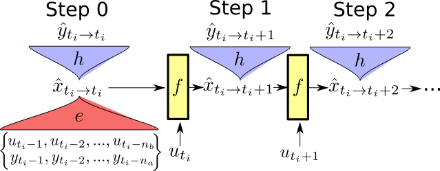

# State-space encoding applied on the video stream output system of the ball in box environment.

The code accompanying a published paper. 

The code here has been updated to be compediable with the newest version of deepSI (our SI toolbox). The exact version used in the paper can be found at `7f375bf4013e294779bebbee28687cb66c45a23d` for this repository and `0216a6fe9f86d93fb1296de71af2289295dae1bf` in deepSI. 

# Instructions

* Get anaconda 3 (python>= 3.6)
* Install pytorch ([Instructions](https://pytorch.org/get-started) CUDA optional)
* Install [deepSI](https://github.com/GerbenBeintema/deepSI)
  * `git clone git@github.com:GerbenBeintema/deepSI.git` 
  * `cd deepSI`
  * `pip install -e .`
* install jupyter notebook 
  * (i.e. `conda install -c conda-forge jupyterlab`)
* Use jupyter notebooks to open notebooks.
  * (e.g. `jupyter notebook ball-in-box-encoder-approach.ipynb`)

# State-space encoding structure

